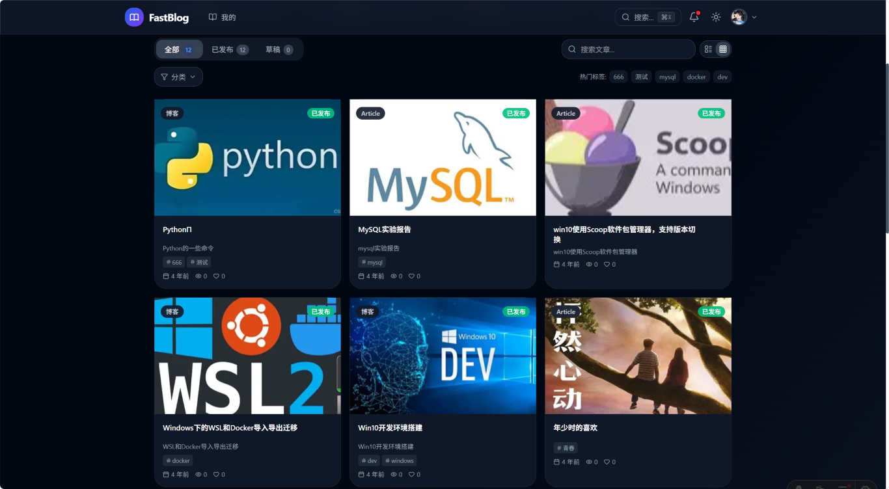

<div align="center">

# FastBlog

### ⚡ The Modern, High-Performance Blog Platform Built for Developers

[](https://github.com/Athenavi/fast_blog/actions/workflows/ci.yml)
[](https://github.com/Athenavi/fast_blog/actions/workflows/release.yml)
[](https://www.python.org/)
[](https://fastapi.tiangolo.com/)
[](https://astro.build/)
[](./LICENSE)
[](https://github.com/Athenavi/fast_blog/pkgs/container/fastblog)

**English** | [中文](README_zh.md)

[🚀 Quick Start](#-quick-start) · [📖 Documentation](#-documentation) · [🎯 Features](#-features) · [🤝 Contributing](#-contributing)

</div>

---

## 🖼️ Screenshots

| Articles | Article View | Media Library |
|----------|--------------|---------------|
|  |  |  |

---

## 🎯 Features

- **FastAPI Backend** — Async web framework with auto-generated API docs
- **Astro Frontend** — Islands architecture, zero-JS by default, blazing-fast first paint
- **Plugin System** — EventBus-driven architecture, extend without touching core code
- **Rich Editor** — TipTap-based WYSIWYG editor
- **Theme Engine** — Hot-swappable themes with React Islands
- **JWT + OAuth2** — Secure auth with cookie/bearer dual-mode, 2FA (TOTP)
- **RBAC** — Granular role-based permission system
- **Full-Text Search** — Meilisearch integration
- **SEO Toolkit** — Auto sitemaps, meta tags, structured data
- **PWA Ready** — Installable as native app with offline support
- **Multi-Language** — i18n support with translation management

---

## 🚀 Quick Start

```bash
# Docker (recommended)
git clone https://github.com/Athenavi/fast_blog.git
cd fast_blog
cp .env.example .env
# 编辑 .env：设置 SECRET_KEY / JWT_SECRET_KEY（>=32 位随机）与数据库密码
docker compose up -d
```

> 生产部署请使用 `docker compose -f docker-compose.prod.yml up -d`（强制要求显式密钥，自动启用多 worker + Redis）。

See [Quick Start Guide](docs/getting-started.md) for manual installation and detailed setup.

---

## 📖 Documentation

| Document | Description |
|----------|-------------|
| [Quick Start](docs/getting-started.md) | Installation & setup |
| [Deployment](docs/deployment.md) | Production deployment, Nginx security, SSL |
| [Development](docs/development.md) | Architecture, plugins, themes, API |
| [Operations](docs/operations.md) | Troubleshooting, AI/MCP, mobile app |

> Full API reference is auto-generated at `http://localhost:9421/api/v2/docs` (Swagger UI).

---

## 🤝 Contributing

We welcome contributions! Please read our [Contributing Guide](docs/development.md#二贡献规范) before submitting PRs.

---

## 📄 License

This project is licensed under the **Apache License 2.0** — see the [LICENSE](LICENSE) file for details.

---

<div align="center">

**If you find FastBlog useful, please consider giving it a ⭐ on GitHub!**

[⬆ Back to Top](#fastblog)

</div>
