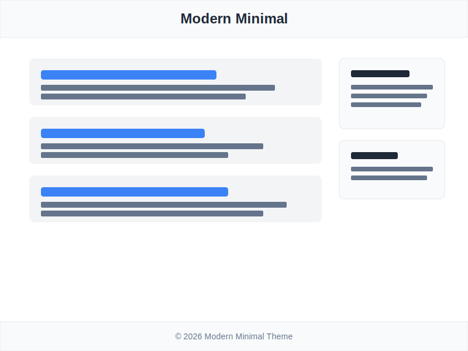

# Modern Minimal Theme

现代简约风格主题，专为个人博客和作品集设计。

## ✨ 特性

- 🎨 **干净优雅的设计** - 极简主义美学，专注于内容
- 📱 **完全响应式** - 完美适配桌面、平板和手机
- 🌓 **自动深色模式** - 根据系统偏好自动切换
- ⚡ **性能优化** - 懒加载图片、平滑滚动
- 🎯 **SEO 友好** - 语义化 HTML 结构
- ♿ **无障碍支持** - 符合 WCAG 标准

## 🎨 设计特点

### 颜色方案
- **主色**: 蓝色 (#3b82f6) - 清新专业
- **辅色**: 石板灰 (#64748b) - 沉稳内敛
- **强调色**: 琥珀色 (#f59e0b) - 温暖活泼
- **背景**: 纯白 (#ffffff) - 简洁明亮

### 排版
- **字体**: Inter - 现代无衬线字体
- **字号**: 16px 基础字号
- **行高**: 1.75 - 优秀的可读性
- **字重**: 600 - 清晰的标题层次

### 布局
- **内容宽度**: max-w-4xl (56rem)
- **侧边栏**: 右侧固定，300px 宽
- **间距**: 基于 4px 网格系统

## 📦 安装

1. 将主题文件夹复制到 `themes/` 目录
2. 在管理后台激活主题
3. 根据需要自定义主题设置

## ⚙️ 配置

编辑 `theme.config.js` 文件来自定义主题：

```javascript
export const themeConfig = {
    colors: {
        primary: '#3b82f6',
        secondary: '#64748b',
        // ... 更多颜色配置
    },
    layout: {
        sidebarPosition: 'right',
        contentWidth: 'max-w-4xl',
        // ... 更多布局配置
    },
    features: {
        showReadingTime: true,
        autoDarkMode: true,
        // ... 更多功能开关
    }
};
```

## 🎯 适用场景

- ✅ 个人博客
- ✅ 作品集展示
- ✅ 技术文章
- ✅ 生活随笔
- ✅ 创意写作

## 📸 截图



## 🔧 技术支持

- FastBlog >= 1.0.0
- 现代浏览器（Chrome, Firefox, Safari, Edge）
- 支持 CSS Grid 和 Flexbox

## 📝 许可证

MIT License

## 👨‍💻 作者

FastBlog Team - [https://fastblog.com](https://fastblog.com)

---

享受简约之美！✨
